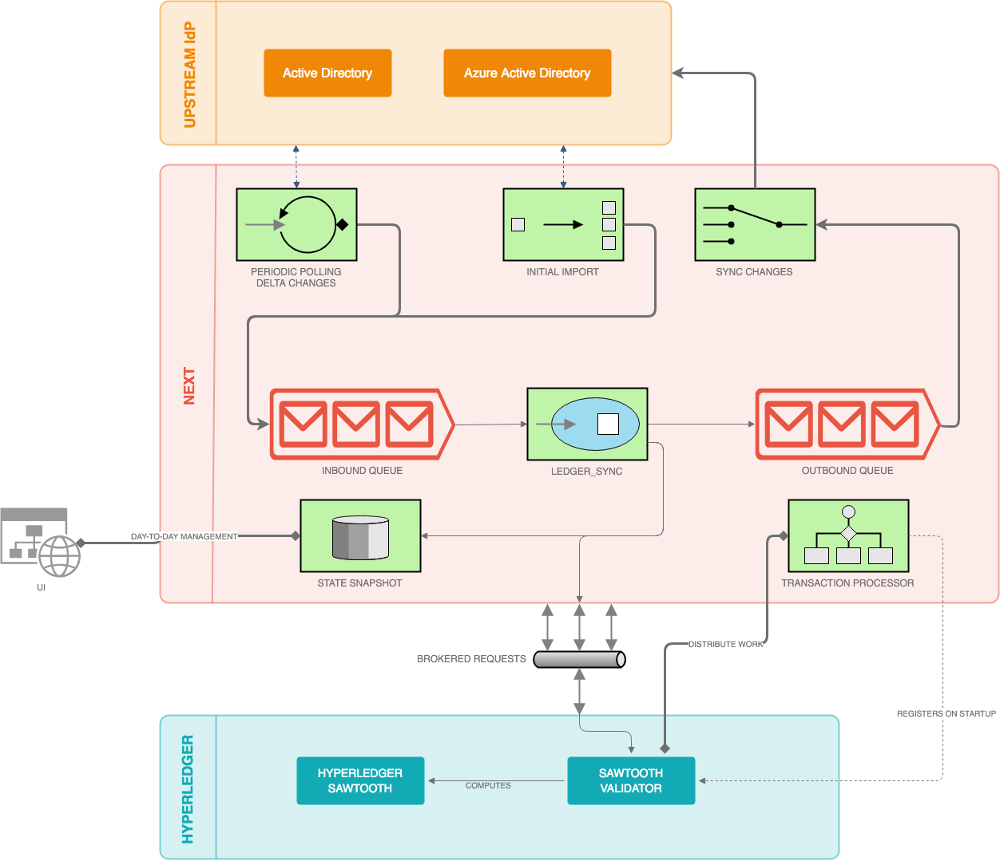
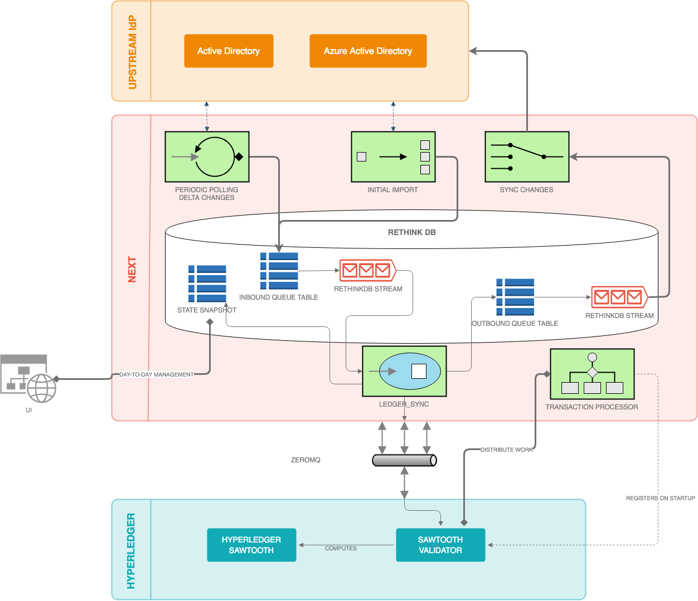

=================
NEXT Architecture
=================

Reference Architecture
======================
A very high-level view of the system

Technology Choices
==================
To fill in several of the above roles, we have adopted RethinkDB as our data storage engine. In addition to a
document storage interface, RethinkDB is unique in that every modification made to a table creates an entry
in a change stream. By leveraging this power, we can react to events asynchronously with stronger guarantees
than you can get in a traditional database without a two-phase commit between your database and message queue. 

Data Mapping
============
As you may expect, Active Directory and Azure Active Directory are very similar identity directories, but they do have some minor differences that must be accounted for. In addition, there are several fields that come back in responses from one provider and not another. 

To account for these differences and support the synchronization efforts of this project, we have to perform some basic field mapping from each provider into a standard NEXT field, then translate those differences correctly when making changes on the other provider. 

In the future, we expect this mapping to be customizable, but as of now it is a static mapping. 

***Any fields not explicitly listed here are not managed by NEXT, nor synchronized back to any upstream identity provider***.

User Fields

+---------------------+----------------------+---------------------+----------------------+-----------------------------+
|      AD Field       |   AD Field Xform     |     NEXT Field      |   AAD Field Xform    |       AAD Field             |
+=====================+======================+=====================+======================+=============================+
| objectGUID          |                      | user_id             |                      | id                          |
+---------------------+----------------------+---------------------+----------------------+-----------------------------+
| whenCreated         |                      | created_date        |                      | createdDateTime             |
+---------------------+----------------------+---------------------+----------------------+-----------------------------+
|                     |                      | deleted_date        |                      | deletedDateTime             |
+---------------------+----------------------+---------------------+----------------------+-----------------------------+
|                     |                      | account_enabled     |                      | accountEnabled              |
+---------------------+----------------------+---------------------+----------------------+-----------------------------+
| telephoneNumber     |                      | business_phones     |                      | businessPhones              |
+---------------------+----------------------+---------------------+----------------------+-----------------------------+
| company             |                      | company_name        |                      | companyName                 |
+---------------------+----------------------+---------------------+----------------------+-----------------------------+
| countryCode         |                      | country             |                      | country                     |
+---------------------+----------------------+---------------------+----------------------+-----------------------------+
|                     |                      | city                |                      | city                        |
+---------------------+----------------------+---------------------+----------------------+-----------------------------+
|                     |                      | office_location     |                      | officeLocation              |
+---------------------+----------------------+---------------------+----------------------+-----------------------------+
|                     |                      | postal_code         |                      | postalCode                  |
+---------------------+----------------------+---------------------+----------------------+-----------------------------+
|                     |                      | state               |                      | state                       |
+---------------------+----------------------+---------------------+----------------------+-----------------------------+
| countryCode         |                      | country             |                      | country                     |
+---------------------+----------------------+---------------------+----------------------+-----------------------------+
| department          |                      | department          |                      | department                  |
+---------------------+----------------------+---------------------+----------------------+-----------------------------+
| memberOf            |                      | member_of           |                      |                             |
+---------------------+----------------------+---------------------+----------------------+-----------------------------+
| displayName         |                      | name                |                      | displayName                 |
+---------------------+----------------------+---------------------+----------------------+-----------------------------+
| employeeID          |                      | employee_id         |                      | employeeId                  |
+---------------------+----------------------+---------------------+----------------------+-----------------------------+
| givenName           |                      | given_name          |                      | givenName                   |
+---------------------+----------------------+---------------------+----------------------+-----------------------------+
| title               |                      | job_title           |                      | jobTitle                    |
+---------------------+----------------------+---------------------+----------------------+-----------------------------+
| mail                |                      | email               |                      | mail                        |
+---------------------+----------------------+---------------------+----------------------+-----------------------------+
| cn                  |                      | user_nickname       |                      | mailNickname                |
+---------------------+----------------------+---------------------+----------------------+-----------------------------+
| manager             |                      | manager             |                      | manager                     |
+---------------------+----------------------+---------------------+----------------------+-----------------------------+
| mobilePhone         |                      | mobile_phone        |                      | mobilePhone                 |
+---------------------+----------------------+---------------------+----------------------+-----------------------------+
| distinguishedName   |                      | distinguished_name  |                      | onPremisesDistinguishedName |
+---------------------+----------------------+---------------------+----------------------+-----------------------------+
| preferredLanguage   |                      | preferred_language  |                      | preferredLanguage           |
+---------------------+----------------------+---------------------+----------------------+-----------------------------+
| streetAddress       |                      | street_address      |                      | streetAddress               |
+---------------------+----------------------+---------------------+----------------------+-----------------------------+
|                     |                      | surname             |                      | surname                     |
+---------------------+----------------------+---------------------+----------------------+-----------------------------+
|                     |                      | usage_location      |                      | usageLocation               |
+---------------------+----------------------+---------------------+----------------------+-----------------------------+
| userPrincipalName   |                      | user_principal_name |                      | userPrincipalName           |
+---------------------+----------------------+---------------------+----------------------+-----------------------------+
|                     |                      | user_type           |                      | userType                    |
+---------------------+----------------------+---------------------+----------------------+-----------------------------+

---

Group Fields

+---------------------+----------------------+---------------------+----------------------+----------------------+
|      AD Field       |   AD Field Xform     |     NEXT Field      |   AAD Field Xform    |       AAD Field      |
+=====================+======================+=====================+======================+======================+
| objectGUID          |                      | role_id             |                      | id                   |
+---------------------+----------------------+---------------------+----------------------+----------------------+
| whenChanged         |                      | created_date        |                      | createdDateTime      |
+---------------------+----------------------+---------------------+----------------------+----------------------+
|                     |                      | deleted_date        |                      | deletedDateTime      |
+---------------------+----------------------+---------------------+----------------------+----------------------+
|                     |                      | classification      |                      | classification       |
+---------------------+----------------------+---------------------+----------------------+----------------------+
| description         |                      | description         |                      | description          |
+---------------------+----------------------+---------------------+----------------------+----------------------+
| name                |                      | name                |                      | displayName          |
+---------------------+----------------------+---------------------+----------------------+----------------------+
| groupType           |                      | group_types         |                      | groupTypes           |
+---------------------+----------------------+---------------------+----------------------+----------------------+
|                     |                      | group_nickname      |                      | mailNickname         |
+---------------------+----------------------+---------------------+----------------------+----------------------+
|                     |                      | mail_enabled        |                      | mailEnabled          |
+---------------------+----------------------+---------------------+----------------------+----------------------+
| member              |                      | members             |                      | members              |
+---------------------+----------------------+---------------------+----------------------+----------------------+
| managedBy           |                      | owners              |                      | owners               |
+---------------------+----------------------+---------------------+----------------------+----------------------+
|                     |                      | security_enabled    |                      | securityEnabled      |
+---------------------+----------------------+---------------------+----------------------+----------------------+
|                     |                      | visibility          |                      | visibility           |
+---------------------+----------------------+---------------------+----------------------+----------------------+

Domain Model
============

Data Model
==========

This directory uses Sawtooth Hyperledger as the distributed ledger. This ledger contains all of the information that
is available in the directory. However, since the data is stored in a Blockchain, the way you store data is a little
different. 

.. mermaid::

    graph TD
        classDef default fill:#f9f,stroke:#333,stroke-width:4px;
        classDef enum fill:#f9f,stroke:#333,stroke-width:4px;

        ObjectType;
        RelationshipType;
        MessageActionType
        AddressSpace;
        class ObjectType enum;

        FamilyAddress;
        FamilyAddress==>BaseFamily;
        Address;
        AddressBase==>StateBase;
        BaseFamily;
        BaseMessage==>AddressBase;
        BaseTransactionProcessor;
        BaseRelationship==>AddressBase;
        StateBase;
        EmailAddress==>AddressBase;

Blockchain Storage
==================

The underlying distributed ledger (aka Blockchain) implementation we're using is the Sawtooth Hyperledger.
The generic model of this ledger is a key-value store with a hash key indexing to an opaque string. This
string is most often a base64-encoded JSON document. Internally, the data structure is actually a Merkle Tree,
but that's not important this concept. 

Applications that work with the Hyperledger platform get to determine their own key structure, with some
restrictions. The generic format of the key is as follows:

.. figure:: _static/hyperledger_addressing.png
    :width: 958px
    :align: center
    :alt: Hyperledger Addressing
    :figclass: align-center

We have chosen to encode our keys in the following manner:

+---------------------+----------------------+---------------------+-------------------------+
|  Bytes              |  Purpose             |  Example            |  Extra                  |
+=====================+======================+=====================+=========================+
| 0-2 (3 Bytes)       | Namespace            | role_id             | Always 'bac001', UTF-8  |
+---------------------+----------------------+---------------------+-------------------------+
| 3-4 (2 Bytes)       | Reserved             | 0x0000              | Reserved by System      |
+---------------------+----------------------+---------------------+-------------------------+
| 5-6 (2 Bytes)       | Object Type          | 0x4444 (Proposal)   | Enum in address_space.py|
+---------------------+----------------------+---------------------+-------------------------+
| 7-18 (12 Bytes)     | Object ID Hash       | 0xE8A76745B898A9C76 | We generate this hash   |
+---------------------+----------------------+---------------------+-------------------------+
| 19-20 (2 Bytes)     | Related Object Type  | 0x5555 (Role)       | Enum in address_space.py|
+---------------------+----------------------+---------------------+-------------------------+
| 21 (1 Byte)         | Relationship Type    | 0x88 (Manager)      | Enum in address_space.py|
+---------------------+----------------------+---------------------+-------------------------+
| 22-33 (12 Bytes)    | Related Obj ID Hash  | 0xFFFFFF45B898A9CFF | All 0-byte for 'None'   |
+---------------------+----------------------+---------------------+-------------------------+
| 34 (1 Byte)         | Reserved             | 0x00                | Reserved by System      |
+---------------------+----------------------+---------------------+-------------------------+

